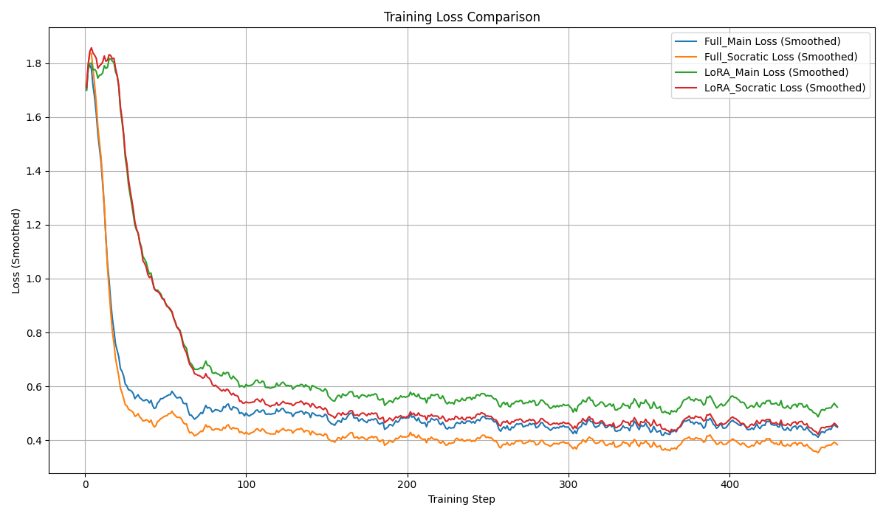
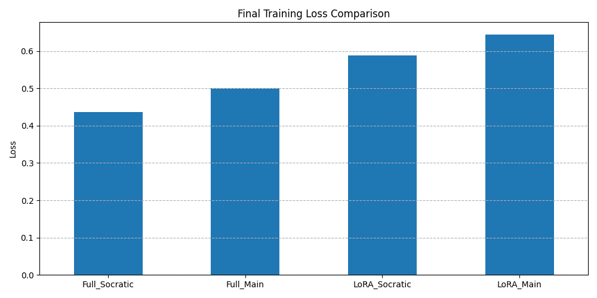

# Presentation Outline: Gemma 2B IT Fine-Tuning for GSM8K

---

## Slide 1: Title Slide

* **Title:** Fine-Tuning Gemma 2B IT for GSM8K Math Reasoning
* **Subtitle:** Comparing Full SFT vs. LoRA and Main vs. Socratic Datasets
* **Presenter(s):** [Your Name(s)]
* **Date:** [Date]

---

## Slide 2: Introduction & Motivation

* **Goal:** Improve mathematical reasoning on the GSM8K dataset via Supervised Fine-Tuning (SFT).
* **Initial Model Consideration:** `google/gemma-9b-it` evaluated initially.
    * Showed high baseline performance (~86% accuracy with one-shot prompting).
    * Decision made to switch to `google/gemma-2b-it` to better observe SFT impact.
* **Methods Explored:**
    * Full Parameter Fine-Tuning (Full SFT)
    * Parameter-Efficient Fine-Tuning (PEFT) using LoRA (`r=16`)
* **Datasets Explored:**
    * GSM8K `main` dataset
    * GSM8K `socratic` dataset (with step-by-step reasoning)

---

## Slide 3: Methodology

* **Base Model:** `google/gemma-2b-it`
* **Fine-Tuning Approaches:**
    * **Full SFT:** Updated all model parameters.
    * **LoRA:** Rank `r=16`, Alpha `alpha=32`. Targeted Modules: `q_proj`, `k_proj`, `v_proj`, `o_proj`, `gate_proj`, `up_proj`, `down_proj`. Approx. 30M trainable parameters (~1.2% of total).
* **Datasets:** GSM8K (`main`, `socratic`) train splits used for respective runs.
* **Training Setup:**
    * Frameworks: Hugging Face `transformers`, `peft`, `accelerate`.
    * Key Hyperparameters: AdamW 8-bit optimizer, Cosine LR scheduler, BF16 precision, Effective Batch Size 8 (1 * 8), 1 Epoch. (Refer to config for details).
    * Gradient Checkpointing used (`use_reentrant=False`).
* **Evaluation:** Exact Match Accuracy on GSM8K test split (100 samples).

---

## Slide 4: Training Observations - Convergence

* **Point:** All four fine-tuning runs (Full/LoRA x Main/Socratic) converged successfully.
* **Evidence:** Training loss curves show a clear decrease from initial high values, eventually stabilizing.
  

---

## Slide 5: Training Observations - Final Loss

* **Point:** Runs using the Socratic dataset achieved lower final training loss compared to Main dataset runs for both Full SFT and LoRA.
* **Evidence:** Bar chart comparison of final loss values.
   
* Socratic dataset leads to lower loss but poorer end task performance.

---

## Slide 6: Training Observations - Throughput & Speed

* **Point:** LoRA runs demonstrated higher training throughput (samples/second) than Full SFT runs.
* **Evidence:** Bar chart comparison of throughput.
    
* **Discussion:** LoRA wasn't that much faster. Maybe base model is too small.

---

## Slide 7: Evaluation Results & Key Findings

* **Accuracy Summary Table:**

    | Run Configuration       | Dataset  | Tuning Method | Exact Match Accuracy (%) |
    | :---------------------- | :------- | :------------ | :----------------------- |
    | Base Model (One-Shot) | Main     | None (Base)   | 6.0                      |
    | **Full SFT - Main** | **Main** | **Full** | **31.0** |
    | Full SFT - Socratic   | Socratic | Full          | 23.0                     |
    | **LoRA SFT - Main** | **Main** | **LoRA** | **20.0** |
    | LoRA SFT - Socratic   | Socratic | LoRA          | 11.0                     |

* **Finding 1: Fine-Tuning Improves Performance:** Both Full SFT and LoRA significantly outperform the base model.
* **Finding 2: Full SFT > LoRA (Accuracy):** Full SFT achieved higher accuracy than LoRA.
* **Finding 3: Loss ≠ Performance:** Runs trained on the Socratic dataset had *lower* final training loss but achieved *lower* test set accuracy compared to Main dataset runs.

---

## Slide 8: Key Lessons Learned

* **Model Choice & Baselines:** Baseline evaluation is crucial. You may not need fine-tuning.
* **Data vs. Evaluation:** Training loss doesn't guarantee end task performance.
* **Debugging Complex Interactions:** Fine-tuning involves intricate library interactions (PEFT, GC, Quantization). Expect debugging; systematic approaches and specific configurations (like `use_reentrant=False` for GC) are often necessary.
* **Evaluation Strategy:** Ensure fair baseline comparisons (e.g., one-shot prompting).

---

## Slide 9: Conclusion & Next Steps

* **Summary:**
    * Fine-tuning `gemma-2b-it` substantially improves GSM8K performance.
    * Full SFT yielded the best accuracy (31% on Main).
    * LoRA offered higher throughput but lower accuracy in this setup.
    * Training dataset choice critically impacts generalization (Main > Socratic here).
    * Training loss alone is not a sufficient indicator of evaluation success.
