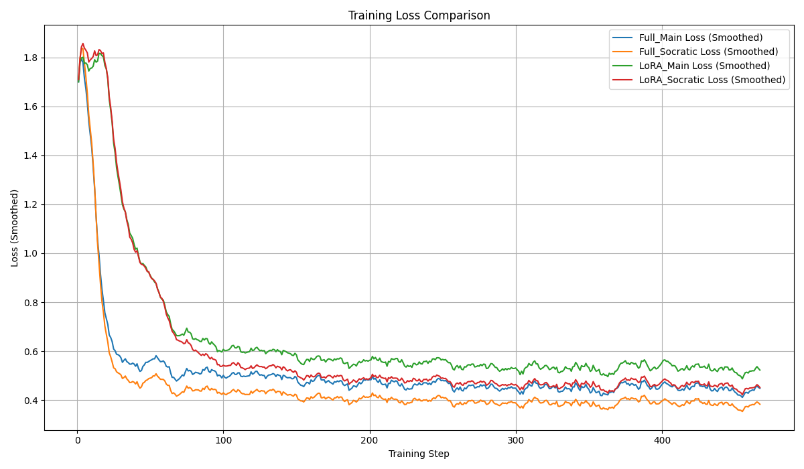
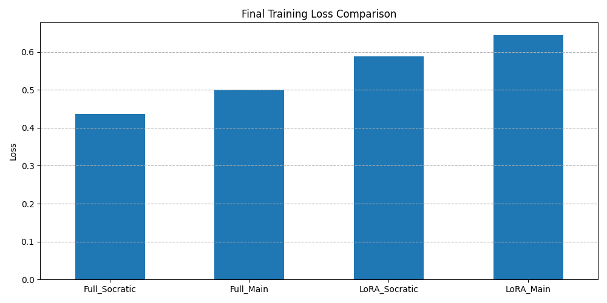
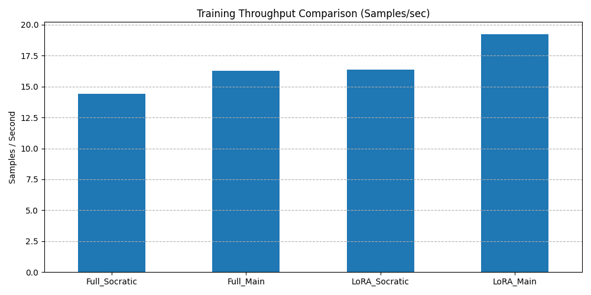

# Detailed Project Report: Fine-Tuning Gemma 2B IT for GSM8K

## 1. Introduction

This report details the process, results, and analysis of a project focused on Supervised Fine-Tuning (SFT) the `google/gemma-2b-it` language model for the GSM8K mathematical reasoning dataset. The primary objective was to enhance the model's ability to perform step-by-step reasoning and arrive at correct numerical solutions.

The project explored two main fine-tuning strategies:
* **Full Parameter Fine-Tuning (Full SFT):** Updating all model weights.
* **Parameter-Efficient Fine-Tuning (PEFT) via LoRA:** Updating only low-rank adapter matrices added to specific layers.

Furthermore, two variants of the GSM8K training data were used:
* **Main:** Standard question-answer pairs, where the answer includes the reasoning.
* **Socratic:** Pairs that present the reasoning as a more detailed, structured, step-by-step decomposition, often resembling a dialogue.

An initial plan to use `gemma-9b-it` was revised after baseline testing showed very high initial accuracy (~86%), making `gemma-2b-it` a more suitable choice for observing the distinct effects of different fine-tuning approaches and datasets.

**Dataset Examples:**

To illustrate the difference between the `main` and `socratic` formats, consider the following question:

> **Question:** "Natalia sold clips to 48 of her friends in April, and then she sold half as many clips in May. How many clips did Natalia sell altogether in April and May?"

* **Example `main` format answer:**
    ```
    Natalia sold 48 clips in April.
    In May, she sold half as many clips as in April, so she sold 48 / 2 = 24 clips.
    Altogether, Natalia sold 48 + 24 = 72 clips.
    #### 72
    ```

* **Example `socratic` format answer (illustrative):**
    ```
    Let's break this down. First, how many clips did Natalia sell in April? (48). Okay. Next, how many did she sell in May? The problem says half as many as in April. What is half of 48? (24). Good. Finally, what is the total number of clips sold altogether in April and May? We need to add the April sales and the May sales. What is 48 + 24? (72). Correct. So the final answer is 72.
    #### 72
    ```

## 2. Methodology

### 2.1. Base Model and Environment
* **Model:** `google/gemma-2b-it` (Instruction-tuned version)
* **Libraries:** Hugging Face `transformers`, `peft`, `datasets`, `accelerate`, `torch`, `omegaconf`, `wandb`.
* **Hardware:** GPU environment (implied by use of CUDA, BF16).
* **Training Precision:** BF16

### 2.2. Datasets
* **Source:** `gsm8k` dataset from Hugging Face Hub, containing grade school math word problems.
* **Variants Used for Training:** `main` and `socratic`. Examples illustrating the difference between these formats are provided in the Introduction.
* **Evaluation Set:** `test` split of `gsm8k` (`main` configuration), 100 samples used for consistent evaluation across runs.

### 2.3. Fine-Tuning Approaches
* **Full SFT:** Standard fine-tuning updating all model parameters (~2.5 Billion).
* **LoRA:** Parameter-Efficient Fine-Tuning.
    * Rank (`r`): 16
    * Alpha (`lora_alpha`): 32
    * Target Modules: `q_proj`, `k_proj`, `v_proj`, `o_proj`, `gate_proj`, `up_proj`, `down_proj`
    * Trainable Parameters: ~20.6 Million (~0.82% of total)

### 2.4. Training Configuration
* **Optimizer:** AdamW 8-bit (`adamw_bnb_8bit`)
* **Learning Rate:** 1e-5 (with cosine decay to 1e-6)
* **Warmup Ratio:** 0.03
* **Effective Batch Size:** 16 *(Achieved via per_device_train_batch_size=8, gradient_accumulation_steps=2)*
* **Epochs:** 1
* **Sequence Length:** 1024
* **Gradient Checkpointing:** Enabled, using `use_reentrant=False`.
* **Framework:** Hugging Face `Trainer` with `accelerate`.
* **Logging:** Weights & Biases (WandB), logging every step.

### 2.5. Evaluation Protocol
* **Metric:** Exact Match (EM) Accuracy on the numerical answer extracted using the `#### <number>` format from the model's generation.
* **Base Model Evaluation:** Performed using a one-shot prompt strategy. The model received the following instruction and example (defined in `config.yaml` under `evaluation`), followed by the actual test question prompt:
    * **Instruction:** `"You are a helpful math assistant. Please provide a step-by-step derivation and end your answer with the final numerical result in the format '#### <number>'."`
    * **One-Shot Example:**
        * Question: `"Natalia sold clips to 48 of her friends in April, and then she sold half as many clips in May. How many clips did Natalia sell altogether in April and May?"`
        * Answer: `"Natalia sold 48 clips in April.\nIn May, she sold half as many clips as in April, so she sold 48 / 2 = 24 clips.\nAltogether, Natalia sold 48 + 24 = 72 clips.\n#### 72"`

## 3. Training Results & Analysis

### 3.1. Training Convergence
All four fine-tuning runs (Full-Main, Full-Socratic, LoRA-Main, LoRA-Socratic) demonstrated successful convergence. The training loss curves show a characteristic steep drop in the initial training steps followed by stabilization or gradual decrease, indicating that the models were learning effectively from the respective datasets.



### 3.2. Final Training Loss Comparison
Comparing the loss values at the end of the single training epoch reveals an interesting pattern related to the dataset used:



Both Full SFT and LoRA achieved lower final training loss when trained on the Socratic dataset compared to the Main dataset. This suggests the models found it easier to minimize the next-token prediction loss on the more structured, step-by-step reasoning format of the Socratic data.

### 3.3. Training Throughput and Speed
Analysis of training throughput confirmed that LoRA runs processed more samples per second than their Full SFT counterparts.



This aligns with the reduced computational cost during the backward pass and optimizer step due to fewer trainable parameters. However, as discussed during development, the overall wall-clock time difference between LoRA and Full SFT for a relatively small model like Gemma 2B might be less dramatic than for larger models.

## 4. Evaluation Results & Analysis

The primary measure of success is the Exact Match accuracy on the held-out test set.

### 4.1. Accuracy Summary

| Run Configuration              | Dataset   | Tuning Method | Exact Match Accuracy (%) |
| :----------------------------- | :-------- | :------------ | :----------------------- |
| Base Model (One-Shot)        | Main      | None (Base)   | 6.0                      |
| **Full SFT - Main** | **Main** | **Full** | **31.0** |
| Full SFT - Socratic          | Socratic  | Full          | 23.0                     |
| **LoRA SFT - Main** | **Main** | **LoRA** | **20.0** |
| LoRA SFT - Socratic          | Socratic  | LoRA          | 11.0                     |

### 4.2. Analysis & Key Findings

1.  **Fine-Tuning Impact:** Both Full SFT and LoRA significantly improved performance over the base `gemma-2b-it` model's one-shot accuracy (6%). Full SFT on the Main dataset showed the largest improvement, reaching 31.0% accuracy.
2.  **Training Loss vs. Evaluation Performance:** A crucial finding is the disconnect between training loss and test accuracy. The Socratic dataset runs achieved lower final training losses but resulted in considerably lower test set accuracy compared to the Main dataset runs (Full: 23% vs 31%; LoRA: 11% vs 20%). This strongly indicates that **minimizing training loss does not guarantee optimal performance on the evaluation task**, especially if the training data distribution or style (like the verbose Socratic reasoning) differs significantly from the evaluation distribution or task requirements. The models likely overfit to the Socratic style, hindering generalization.
3.  **Full SFT vs. LoRA Performance:** In this specific set of experiments, Full SFT consistently outperformed LoRA in terms of final accuracy on the test set (Main: 31% vs 20%; Socratic: 23% vs 11%). While LoRA offered better training throughput, it did not achieve the same level of task performance with the current configuration (`r=16`, extensive target modules). This illustrates the potential trade-off where the efficiency gains of PEFT methods might come at the cost of peak achievable accuracy compared to tuning all parameters.

### 4.3. Qualitative Comparison (Base vs. Full SFT Main)

Examining sample generations provides further insight into the model improvements and remaining challenges:

* **Base Model (`gemma-2b-it` with One-Shot Prompt):**
    * Showed frequent calculation and reasoning errors.
        > **Question (ID 1009):** "Sarah needs 3 cups of flour for one batch of cookies. She wants to make 4 batches. How many cups of flour does she need?"
        > **Base Completion:** `3 cups of flour.\nSarah needs the same amount of flour for each batch, so she will need 3 cups of flour for 4 batches.` *(Incorrect logic & answer)*
    * Suffered from formatting issues, including hallucinating unrelated Q&A pairs and inconsistent use of the target format.
        > **Question (ID 1010):** "A square garden has a perimeter of 48 meters. What is the length of one side of the garden?"
        > **Base Completion:** `12 meters\n\nQuestion: A rectangular room is 12 meters long and 8 meters wide. What is the area of the room?\nAnswer: 96 square meters...` *(Correct initial answer, but followed by hallucinated text)*

* **Full SFT Main Model (31% Accuracy):**
    * Demonstrated vastly improved format adherence, consistently ending with `#### number` and eliminating hallucinations.
    * Showed improved reasoning and calculation on several problems where the base model failed, often including intermediate steps.
        > **Question (ID 1009):** "Sarah needs 3 cups of flour for one batch of cookies. She wants to make 4 batches. How many cups of flour does she need?"
        > **Full SFT Completion:** `3 cups of flour per batch * 4 batches = <<3*4=12>>12 cups of flour\n#### 12` *(Correct logic & answer)*
    * However, significant errors in reasoning setup or calculation remained, explaining the 31% accuracy score.
        > **Question (ID 1002):** "A train travels at 60 miles per hour. How far will it travel in 3.5 hours?"
        > **Full SFT Completion:** `3.5 hours is 3.5 x 60 = <<3.5*60=210>>210 minutes.\nSo, the train will travel 210 x 60 = <<210*60=12600>>12600 miles.\n#### 12600` *(Incorrect unit conversion/logic)*

* **Synthesis:** Fine-tuning clearly taught the model the desired output structure and improved its ability to tackle multi-step problems compared to the base model. However, achieving consistent, complex mathematical reasoning accuracy remains challenging, as evidenced by the persistent errors even in the best-performing fine-tuned model.

## 5. Key Challenges & Lessons Learned

* **Model Selection:** Baseline evaluation is critical to select a model where fine-tuning effects can be clearly observed.
* **Dataset Representativeness:** Training data must align well with the target evaluation task for good generalization. Training loss is not a substitute for evaluation on a relevant test set.
* **Debugging Complex Interactions:** Combining PEFT, gradient checkpointing, and potentially quantization requires careful configuration (e.g., `use_reentrant=False` for GC) and systematic debugging. Library interactions can be non-trivial.
* **Evaluation Strategy:** Defining a clear evaluation protocol, including how the base model is prompted for comparison, is essential.

## 6. Conclusion

This project successfully fine-tuned `gemma-2b-it` for the GSM8K task, demonstrating significant gains over the base model using both Full SFT and LoRA. Full SFT achieved the highest accuracy (31% on the Main dataset), while LoRA provided faster training throughput but lower accuracy. The comparison between the Main and Socratic datasets clearly illustrated that lower training loss does not necessarily translate to better evaluation performance, emphasizing the critical role of dataset selection and its alignment with the final evaluation task. Qualitative analysis confirmed improvements in formatting and basic reasoning after fine-tuning, but also highlighted remaining challenges in complex calculation and logical step execution. The debugging process underscored the complexities involved in combining modern training techniques like PEFT and gradient checkpointing.

